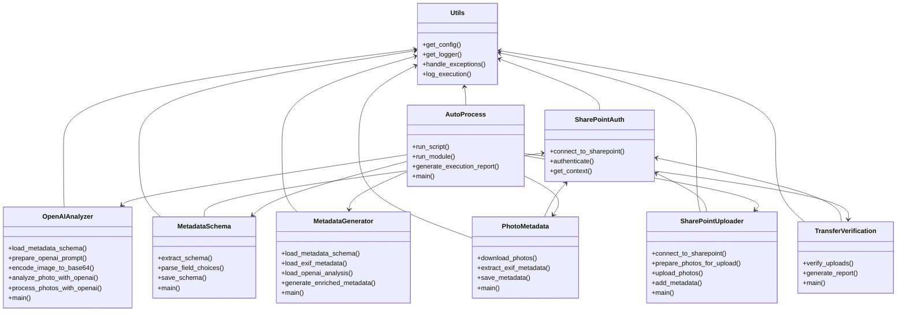

# Диаграмма компонентов Agent

[//]: # (Диаграмма компонентов системы)

```mermaid
classDiagram
    class AutoProcess {
        +run_script()
        +run_module()
        +generate_execution_report()
        +main()
    }
    
    class SharePointAuth {
        +connect_to_sharepoint()
        +authenticate()
        +get_context()
    }
    
    class MetadataSchema {
        +extract_schema()
        +parse_field_choices()
        +save_schema()
        +main()
    }
    
    class PhotoMetadata {
        +download_photos()
        +extract_exif_metadata()
        +save_metadata()
        +main()
    }
    
    class OpenAIAnalyzer {
        +load_metadata_schema()
        +prepare_openai_prompt()
        +encode_image_to_base64()
        +analyze_photo_with_openai()
        +process_photos_with_openai()
        +main()
    }
    
    class MetadataGenerator {
        +load_metadata_schema()
        +load_exif_metadata()
        +load_openai_analysis()
        +generate_enriched_metadata()
        +main()
    }
    
    class SharePointUploader {
        +connect_to_sharepoint()
        +prepare_photos_for_upload()
        +upload_photos()
        +add_metadata()
        +main()
    }
    
    class TransferVerification {
        +verify_uploads()
        +generate_report()
        +main()
    }
    
    class Utils {
        +get_config()
        +get_logger()
        +handle_exceptions()
        +log_execution()
    }
    
    AutoProcess --> MetadataSchema
    AutoProcess --> PhotoMetadata
    AutoProcess --> OpenAIAnalyzer
    AutoProcess --> MetadataGenerator
    AutoProcess --> SharePointUploader
    AutoProcess --> TransferVerification
    
    SharePointAuth <-- MetadataSchema
    SharePointAuth <-- PhotoMetadata
    SharePointAuth <-- SharePointUploader
    SharePointAuth <-- TransferVerification
    
    Utils <-- AutoProcess
    Utils <-- MetadataSchema
    Utils <-- PhotoMetadata
    Utils <-- OpenAIAnalyzer
    Utils <-- MetadataGenerator
    Utils <-- SharePointUploader
    Utils <-- TransferVerification
    Utils <-- SharePointAuth
```

Эта диаграмма показывает структуру классов и компонентов системы Agent и взаимосвязи между ними.
