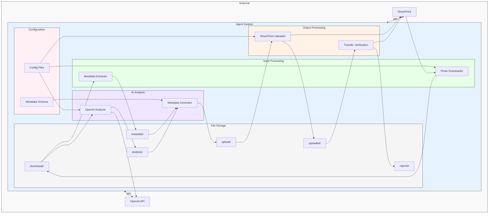

# Диаграмма потока данных Agent

[//]: # (Диаграмма потока данных)

```mermaid
flowchart TD
    subgraph External
        SP[SharePoint] <--> |API| Agent
        OAI[OpenAI API] <--> |API| Agent
    end
    
    subgraph Agent["Agent System"]
        subgraph Config["Configuration"]
            CF[Config Files]
            MS[Metadata Schema]
        end
        
        subgraph Input["Input Processing"]
            PD[Photo Downloader]
            ME[Metadata Extractor]
        end
        
        subgraph Analysis["AI Analysis"]
            OA[OpenAI Analyzer]
            MG[Metadata Generator]
        end
        
        subgraph Output["Output Processing"]
            SU[SharePoint Uploader]
            TV[Transfer Verification]
        end
        
        subgraph Files["File Storage"]
            direction TB
            Downloads[downloads/]
            Metadata[metadata/]
            AnalysisResults[analysis/]
            Upload[upload/]
            Uploaded[uploaded/]
            Reports[reports/]
        end
        
        CF --> PD
        CF --> OA
        CF --> SU
        MS --> MG
        
        PD --> Downloads
        ME --> Metadata
        OA --> AnalysisResults
        MG --> Upload
        SU --> Uploaded
        TV --> Reports
        
        Downloads --> ME
        Downloads --> OA
        Metadata --> MG
        AnalysisResults --> MG
        Upload --> SU
        Uploaded --> TV
    end
    
    SP --> PD
    OA --> OAI
    SU --> SP
    TV --> SP

style External fill:#f9f9f9,stroke:#333,stroke-width:1px
style Agent fill:#e6f3ff,stroke:#333,stroke-width:1px
style Config fill:#fff0f5,stroke:#333,stroke-width:1px
style Input fill:#e6ffe6,stroke:#333,stroke-width:1px
style Analysis fill:#f0e6ff,stroke:#333,stroke-width:1px
style Output fill:#fff2e6,stroke:#333,stroke-width:1px
style Files fill:#f5f5f5,stroke:#333,stroke-width:1px
```

Эта диаграмма иллюстрирует поток данных между различными компонентами системы Agent и внешними сервисами.
