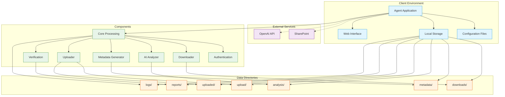

# Диаграмма развертывания Agent

[//]: # (Диаграмма развертывания)

```mermaid
flowchart TD
    subgraph "Client Environment"
        App[Agent Application]
        Config[Configuration Files]
        Storage[Local Storage]
        WebUI[Web Interface]
        
        App --> Config
        App --> Storage
        App --> WebUI
    end
    
    subgraph "External Services"
        SP[SharePoint]
        OAI[OpenAI API]
    end
    
    App -.-> SP
    App -.-> OAI
    
    subgraph "Components"
        Core[Core Processing]
        Auth[Authentication]
        Download[Downloader]
        Upload[Uploader]
        Analysis[AI Analyzer]
        Metadata[Metadata Generator]
        Verify[Verification]
        
        Core --> Auth
        Core --> Download
        Core --> Analysis
        Core --> Metadata
        Core --> Upload
        Core --> Verify
    end
    
    App --> Core
    
    subgraph "Data Directories"
        DD[downloads/]
        MD[metadata/]
        AD[analysis/]
        UD[upload/]
        UPD[uploaded/]
        RD[reports/]
        LD[logs/]
    end
    
    Storage --> DD
    Storage --> MD
    Storage --> AD
    Storage --> UD
    Storage --> UPD
    Storage --> RD
    Storage --> LD
    
    Download --> DD
    Analysis --> AD
    Metadata --> MD
    Upload --> UD
    Upload --> UPD
    Verify --> RD
    Core --> LD
    
    classDef app fill:#e1f5fe,stroke:#0288d1,stroke-width:1px;
    classDef comp fill:#e8f5e9,stroke:#388e3c,stroke-width:1px;
    classDef ext fill:#f3e5f5,stroke:#7b1fa2,stroke-width:1px;
    classDef data fill:#fff3e0,stroke:#e65100,stroke-width:1px;
    
    class App,Config,Storage,WebUI app;
    class Core,Auth,Download,Upload,Analysis,Metadata,Verify comp;
    class SP,OAI ext;
    class DD,MD,AD,UD,UPD,RD,LD data;
```

Эта диаграмма показывает развертывание системы Agent, включая компоненты приложения, внешние сервисы и структуру данных.
