# Структура каталогов и поток данных

[//]: # (Диаграмма структуры каталогов и потока данных)

```mermaid
graph TD
    classDef rootDir fill:#f9f9f9,stroke:#666,stroke-width:2px
    classDef mainDir fill:#e1f5fe,stroke:#0288d1,stroke-width:1px
    classDef subDir fill:#e8f5e9,stroke:#388e3c,stroke-width:1px
    classDef configDir fill:#fff3e0,stroke:#f57c00,stroke-width:1px
    classDef dataFile fill:#f3e5f5,stroke:#7b1fa2,stroke-width:1px
    classDef sourceCode fill:#e8eaf6,stroke:#3949ab,stroke-width:1px
    classDef webFiles fill:#fce4ec,stroke:#d81b60,stroke-width:1px
    
    Root["C:/Projekts/Agent/"] --> Config["config/"]
    Root --> Data["data/"]
    Root --> Docs["docs/"]
    Root --> Logs["logs/"]
    Root --> Src["src/"]
    Root --> Web["web/"]
    Root --> Readme["README.md"]
    Root --> Requirements["requirements.txt"]
    
    Config --> ConfigEnv["config.env"]
    Config --> SchemaJson["sharepoint_choices.json"]
    
    Data --> Downloads["downloads/"]
    Data --> Metadata["metadata/"]
    Data --> Analysis["analysis/"]
    Data --> Upload["upload/"]
    Data --> Uploaded["uploaded/"]
    Data --> Reports["reports/"]
    
    Downloads --> DownloadedPhotos["photo1.jpg, photo2.jpg, ..."]
    Metadata --> ExifJson["photo1_exif.json, photo2_exif.json, ..."]
    Analysis --> AnalysisJson["photo1_analysis.json, photo2_analysis.json, ..."]
    Upload --> EnrichedJson["photo1_enriched.json, photo2_enriched.json, ..."]
    Upload --> RenamedPhotos["Company_Referenzfoto_001.jpg, ..."]
    Uploaded --> UploadConfirm["uploaded_files.json"]
    Reports --> ReportHtml["transfer_report_20230615.html"]
    
    Logs --> ProcessLog["auto_process_20230615.log"]
    Logs --> ComponentLogs["component_logs/"]
    
    Src --> AutoProcess["auto_process.py"]
    Src --> MetadataSchema["metadata_schema.py"]
    Src --> PhotoMetadata["photo_metadata.py"]
    Src --> OpenAIAnalyzer["openai_analyzer.py"]
    Src --> MetadataGenerator["metadata_generator.py"]
    Src --> SharepointUploader["sharepoint_uploader.py"]
    Src --> TransferVerification["transfer_verification.py"]
    Src --> Utils["utils/"]
    Src --> Tests["tests/"]
    
    Utils --> ConfigPy["config.py"]
    Utils --> LoggingPy["logging.py"]
    Utils --> PathsPy["paths.py"]
    Utils --> ApiPy["api.py"]
    
    Web --> PageTsx["page.tsx"]
    Web --> ComponentsTsx["*Card.tsx, *Table.tsx, ..."]
    Web --> ServiceTs["sharepoint.ts, openai.ts, ..."]
    
    %% Data flow arrows
    SharepointAuth[fa:fa-arrow-right] -->|1| Downloads
    Downloads -->|2| Metadata
    Downloads -->|3| Analysis
    Metadata -->|4a| Upload
    Analysis -->|4b| Upload
    Upload -->|5| Uploaded
    Uploaded -->|6| Reports
    
    class Root rootDir
    class Config,Data,Docs,Logs,Src,Web mainDir
    class Downloads,Metadata,Analysis,Upload,Uploaded,Reports,Utils,Tests,ComponentLogs subDir
    class ConfigEnv,SchemaJson configDir
    class DownloadedPhotos,ExifJson,AnalysisJson,EnrichedJson,RenamedPhotos,UploadConfirm,ReportHtml,ProcessLog dataFile
    class AutoProcess,MetadataSchema,PhotoMetadata,OpenAIAnalyzer,MetadataGenerator,SharepointUploader,TransferVerification,ConfigPy,LoggingPy,PathsPy,ApiPy sourceCode
    class PageTsx,ComponentsTsx,ServiceTs webFiles
```

Эта диаграмма иллюстрирует физическую структуру каталогов проекта Agent и поток данных между различными файлами и папками.
