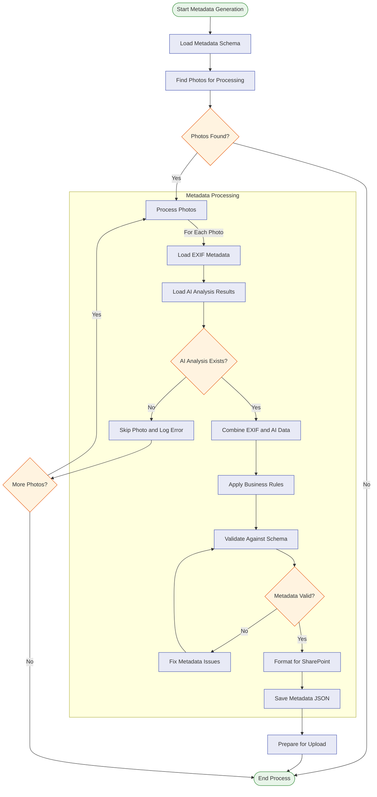

# Процесс обогащения метаданных

[//]: # (Диаграмма процесса обогащения метаданных)

Эта диаграмма показывает процесс обогащения метаданных, объединяя данные EXIF и результаты анализа OpenAI для создания полного набора метаданных для SharePoint.
