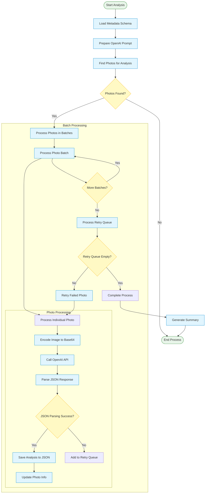

# Рабочий процесс анализа OpenAI

[//]: # (Детальная диаграмма процесса анализа OpenAI)

Эта диаграмма детально показывает процесс анализа фотографий с использованием OpenAI API, включая обработку ошибок и повторные попытки.
