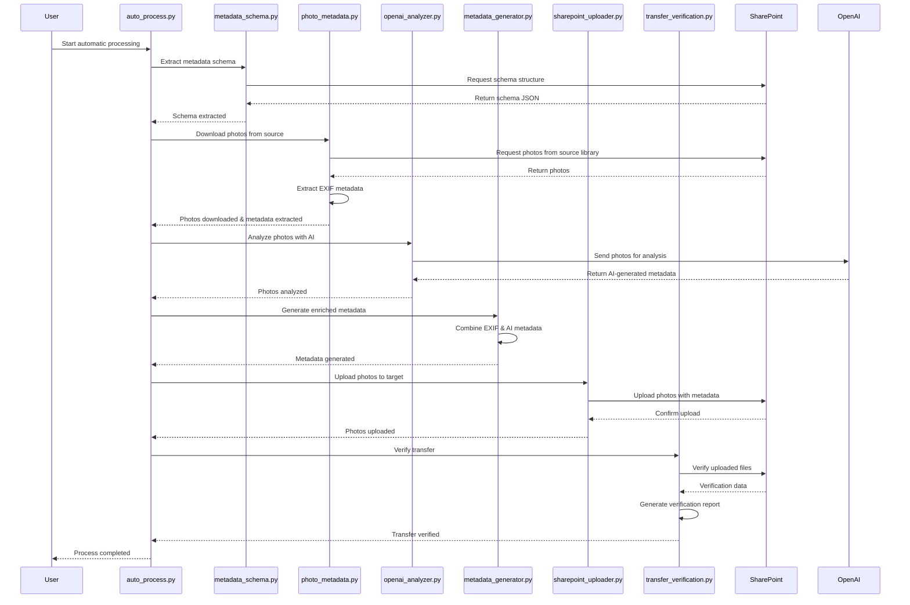

# Диаграмма последовательности процессов Agent

[//]: # (Диаграмма последовательности процессов)

Эта диаграмма показывает последовательность взаимодействия между различными компонентами системы Agent при выполнении полного процесса обработки фотографий.
