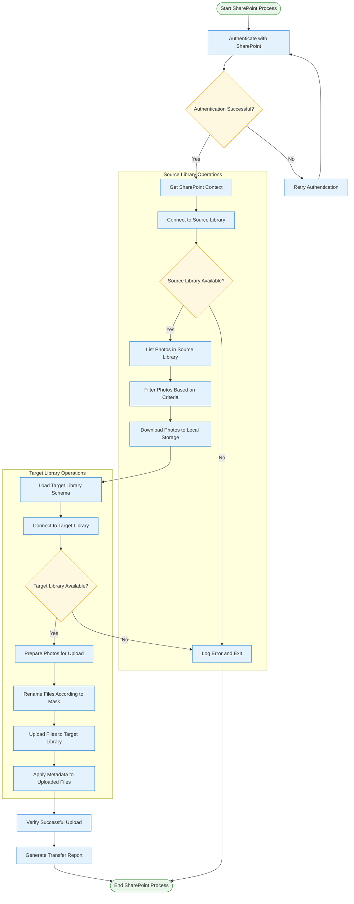

# Интеграция с SharePoint

[//]: # (Диаграмма интеграции с SharePoint)

```mermaid
flowchart TD
    Start([Start SharePoint Process]) --> Auth[Authenticate with SharePoint]
    Auth --> CheckAuth{Authentication Successful?}
    CheckAuth -->|No| RetryAuth[Retry Authentication]
    RetryAuth --> Auth
    CheckAuth -->|Yes| GetContext[Get SharePoint Context]
    
    subgraph "Source Library Operations"
        GetContext --> ConnSource[Connect to Source Library]
        ConnSource --> CheckSource{Source Library Available?}
        CheckSource -->|No| LogError[Log Error and Exit]
        CheckSource -->|Yes| ListPhotos[List Photos in Source Library]
        ListPhotos --> FilterPhotos[Filter Photos Based on Criteria]
        FilterPhotos --> DownloadPhotos[Download Photos to Local Storage]
    end
    
    subgraph "Target Library Operations"
        DownloadPhotos --> LoadSchema[Load Target Library Schema]
        LoadSchema --> ConnTarget[Connect to Target Library]
        ConnTarget --> CheckTarget{Target Library Available?}
        CheckTarget -->|No| LogError
        CheckTarget -->|Yes| PrepareUpload[Prepare Photos for Upload]
        PrepareUpload --> RenameFiles[Rename Files According to Mask]
        RenameFiles --> UploadFiles[Upload Files to Target Library]
        UploadFiles --> ApplyMetadata[Apply Metadata to Uploaded Files]
    end
    
    ApplyMetadata --> VerifyUpload[Verify Successful Upload]
    VerifyUpload --> GenerateReport[Generate Transfer Report]
    GenerateReport --> End([End SharePoint Process])
    
    LogError --> End
    
    classDef operation fill:#e3f2fd,stroke:#1976d2,stroke-width:1px;
    classDef decision fill:#fff8e1,stroke:#ffa000,stroke-width:1px;
    classDef terminator fill:#e8f5e9,stroke:#388e3c,stroke-width:1px;
    
    class Auth,GetContext,ConnSource,ListPhotos,FilterPhotos,DownloadPhotos,LoadSchema,ConnTarget,PrepareUpload,RenameFiles,UploadFiles,ApplyMetadata,VerifyUpload,GenerateReport,RetryAuth,LogError operation;
    class CheckAuth,CheckSource,CheckTarget decision;
    class Start,End terminator;
```

Эта диаграмма иллюстрирует процесс интеграции с SharePoint, включая операции с исходной и целевой библиотеками.
