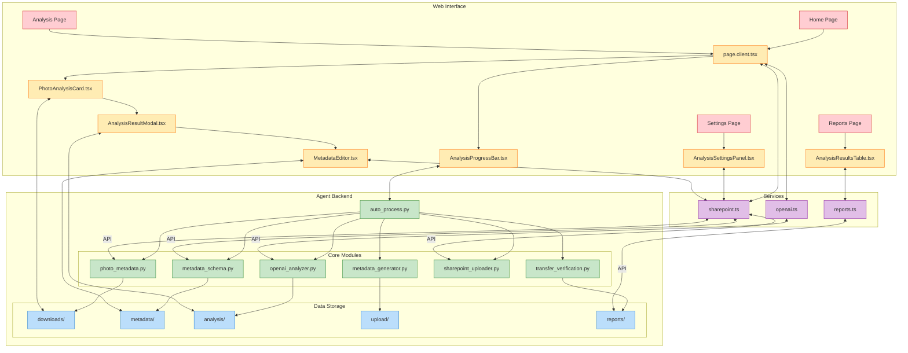

# Интеграция веб-интерфейса

[//]: # (Диаграмма интеграции веб-интерфейса с компонентами Agent)

Эта диаграмма показывает интеграцию веб-интерфейса с основными компонентами системы Agent, включая взаимодействие между фронтендом и бэкендом.
